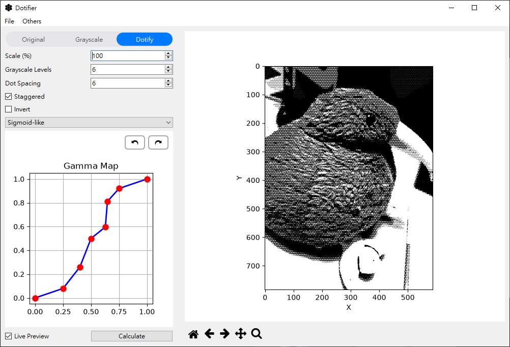
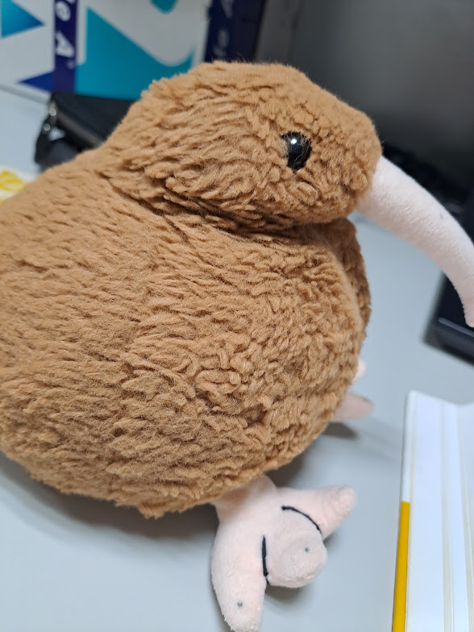
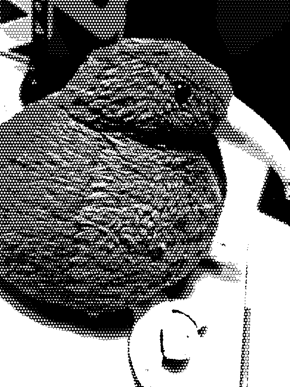

# Dotifier

## Demo
<p align="center">

</p>


| Input Image | Output Halftone Image |
| :---: | :---: |
|  |  |

---

## Project Description

This project is an image processing tool designed to help users convert input images into grayscale bitmap images with a halftone effect. The processed images allow for more controllable and precise output in laser engraving, enhancing the detail performance and visual stability of photos and patterns during the engraving process.

---

## Usage

### How to Run
Run the following command in command prompt / terminal inside the project folder:
```bash
python main.py
```
to start using the application.

If you do not have Python installed, you can use the [Portable Executable](https://mega.nz/file/DYomCbhY#qe5iFP-DqsKh07iV0LNto_6TP8a7fKmU14UWk4y8fPE). This portable executable was packaged on Windows 11. For language settings, please refer to [Language Pack Configuration](#language-pack-configuration).

(If the portable executable link is broken, feel free to repackage it yourself using a Python bundler like PyInstaller. However, note that you must NOT use the `--onefile` option, as doing so violates the license.)


### Requirements
This project was developed on Python 3.12.6 and depends on only 4 non-standard packages:
* PySide6
* numpy
* opencv-python
* matplotlib

Although not exhaustively tested, it is expected to run normally on any Python version compatible with these four packages.

### User Interface Controls
The Gamma map control panel located at the bottom-left of the UI allows users to adjust curves and level mappings:
* **Add a node**: Left-click on the blue line.
* **Move a node**: Click and drag the node with the left mouse button to the desired position.
* **Delete a node**: Right-click on the target node.

---

## Language Pack Configuration

This program supports multi-language UI settings. Upon startup, the system automatically reads the `language.json` file in the same directory.

* **Modify & Extend**: To change UI text or add translations, simply open and edit `language.json`.
* **Important Note**: Ensure the file name remains `language.json`; otherwise, the program cannot load the language pack properly.
* **Portable Version**: `language.json` should be located inside the `_internal` folder.
* **Recovery from Corruption**: If `language.json` is accidentally corrupted, simply delete it and restart the program. The application will automatically generate a default English version of `language.json`.

---

## License

* The source code of this project is licensed under the `LGPL` license. For details, please refer to the `LICENSE` file in the project directory.
* All icon assets in this project are released under the `CC BY-NC 4.0` International License.

---

## Parameter & Algorithm Explanation

* **Grayscale Levels**: Determines how many discrete brightness levels are used to represent the image during grayscaling.
* **Dot Spacing**: Determines the spacing between halftone dots. The value specifies the pixel interval between dots. Therefore, **a larger dot spacing value results in lower dot density**.
* Different grayscale levels use the same dot placement rules and spacing; visual contrast between levels is primarily expressed through differences in **dot pixel size**.
